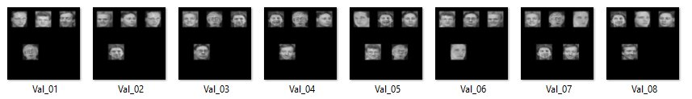
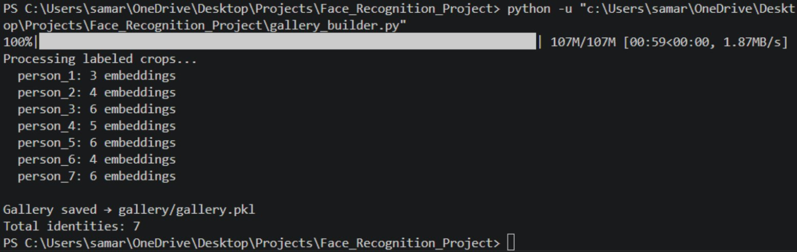
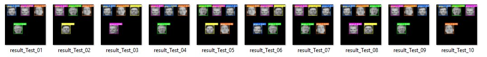

# Face Detection & Recognition System

A computer vision pipeline that detects and identifies faces in images using YOLOv8 for detection and FaceNet for recognition. Built with Python, PyTorch, and OpenCV.

---

## Table of Contents
1. [Project Overview](#project-overview)
2. [Theory](#theory)
3. [Dataset](#dataset)
4. [Project Structure](#project-structure)
5. [Installation](#installation)
6. [Step-by-Step SOP](#step-by-step-sop)
7. [Results](#results)
8. [Key Parameters](#key-parameters)
9. [Permitted Libraries](#permitted-libraries)

---

## Project Overview

This system takes a single image as input, detects the location of every face in it (bounding box), and labels each detected face with the correct person's identity and a confidence score.

**Key specs:**
- Input: Single image (512×512 px)
- Output: Annotated image with bounding boxes + person labels + confidence scores
- Gallery: 7 persons, 3–6 reference embeddings each
- Test set: 10 images featuring 5 of the 7 gallery persons

---

## Theory

### What is Face Detection?
Face detection is the process of locating faces in an image and returning their coordinates as bounding boxes. This project uses **YOLOv8s** (You Only Look Once), a single-pass convolutional neural network that divides the image into a grid, predicts bounding boxes and confidence scores simultaneously, and is significantly faster than traditional sliding window approaches.

### What is Face Recognition?
Face recognition is the process of identifying *who* a detected face belongs to. This project uses a two-stage approach:

**Stage 1 — Embedding Extraction (FaceNet)**
FaceNet is a deep neural network (InceptionResNet-V1 architecture) trained on millions of face images. When given a face crop, it outputs a **512-dimensional embedding vector** — essentially a numerical fingerprint unique to that person's face. Two images of the same person will produce vectors that are very close together in 512-dimensional space. Two different people will produce vectors far apart.

**Stage 2 — Similarity Matching (Cosine Similarity)**
Once embeddings are extracted, the system compares each test face embedding against a pre-built gallery of reference embeddings using cosine similarity:

```
cosine_similarity(A, B) = (A · B) / (||A|| × ||B||)
```

A score of 1.0 = identical, 0.0 = completely different. If the best match score exceeds a threshold (0.35), the person is identified. Otherwise labeled "Unknown".

### Gallery (Centroid Matching)
For each person in the gallery, multiple embeddings are averaged into a single **centroid vector**. This makes matching more stable and robust to minor variations in lighting, angle, or expression across different images of the same person.

### Full Pipeline
```
Input Image (512×512)
        │
        ▼
  ┌─────────────┐
  │  YOLOv8s    │  → Bounding boxes around each face
  │  Detection  │  → conf=0.35, multi-scale (640 + 1280)
  └──────┬──────┘
         │  Face crops
         ▼
  ┌─────────────┐
  │   FaceNet   │  → 512-dim embedding vector per face
  │  Embedding  │  → Pretrained on VGGFace2 dataset
  └──────┬──────┘
         │  Embedding vectors
         ▼
  ┌─────────────┐
  │   Cosine    │  → Compare vs gallery centroids
  │  Matching   │  → Threshold = 0.35
  └──────┬──────┘
         │
         ▼
  Annotated Output Image
  (bounding box + person label + confidence score)
```

---

## Dataset

### Source
**AT&T Database of Faces (ORL)**
- Kaggle: https://www.kaggle.com/datasets/kasikrit/att-database-of-faces
- 40 subjects (s1–s40), 10 images each, 400 total
- Resolution: 92×112 px, grayscale PGM format
- Controlled lighting, slight pose variation, black background

### How the Project Dataset Was Created
Only **S1 to S7** from the AT&T database are used. The rest are discarded. A custom script (`dataset_preparation.py`) generates composite images that mimic the format of a real industrial inspection dataset:

**InputData (Val_01 to Val_08)**
- 8 composite images, 512×512 px, black background
- 4–5 faces randomly placed per image
- Faces drawn from gallery images (first 7 of 10 per subject)
- Used for manual labeling and gallery building

**Test_512_512 (Test_01 to Test_10)**
- 10 composite images, 512×512 px, black background
- 4–5 faces per image, subjects S1–S5 only
- Faces drawn from held-out images (last 3 of 10 per subject)
- Used for final evaluation only — never seen during gallery building

### InputData Preview



*Val_01 through Val_08 — 8 composite images with 4–5 faces each on black background*

---

## Project Structure

```
Face_Recognition_Project/
│
├── data/
│   ├── S1/ … S7/              ← AT&T dataset (download from Kaggle)
│   ├── InputData/             ← Generated by dataset_preparation.py
│   └── Test_512_512/          ← Generated by dataset_preparation.py
│
├── labeled_crops/             ← Generated by label_tool.py
│   ├── person_1/
│   ├── person_2/
│   └── ... person_7/
│
├── gallery/
│   └── gallery.pkl            ← Generated by gallery_builder.py
│
├── output/                    ← Generated by inference.py
│
├── yolov8s.pt                 ← Download manually (link below)
├── dataset_preparation.py
├── face_detector.py
├── face_embedder.py
├── label_tool.py
├── gallery_builder.py
├── inference.py
├── requirements.txt
└── README.md
```

---

## Installation

### 1. Clone the repository
```bash
git clone https://github.com/samarth-raj-07/Face_recognition_system
cd Face_recognition_system
```

### 2. Install dependencies
```bash
pip install -r requirements.txt
```

### 3. Download AT&T Dataset
- Go to: https://www.kaggle.com/datasets/kasikrit/att-database-of-faces
- Download and extract
- Keep only folders **S1 to S7**, place them inside `data/`

```
data/
├── S1/
├── S2/
├── S3/
├── S4/
├── S5/
├── S6/
└── S7/
```

### 4. Download YOLOv8s Weights
- Go to: https://github.com/ultralytics/assets/releases/tag/v8.2.0
- Download `yolov8s.pt`
- Place it in the project root folder

---

## Step-by-Step SOP

### Step 1 — Generate Dataset
```bash
python dataset_preparation.py
```
**What it does:**
- Converts any PGM images to JPG automatically
- Splits each subject's 10 images: first 7 → gallery pool, last 3 → test pool
- Creates 8 composite InputData images (Val_01 to Val_08) — 4 to 5 random faces per image on black 512×512 canvas
- Creates 10 composite test images (Test_01 to Test_10) — subjects S1 to S5 only
- Uses `random.seed(42)` for reproducibility

**Expected output:**
```
PGM → JPG done
S1: 10 images found
...
Creating InputData...
  Val_01.jpg — 5 faces — ['S3', 'S1', 'S5', 'S7', 'S2']
...
Creating Test_512_512...
  Test_01.jpg — 4 faces — ['S2', 'S4', 'S1', 'S5']
...
✅ Done!
```

---

### Step 2 — Label Faces (Manual)
```bash
python label_tool.py
```
**What it does:**
- Runs YOLOv8s detection on each Val image
- Pops up a window showing one detected face crop at a time (resized to 224×224 for visibility)
- Waits for keyboard input

**How to label:**
- Press **1 to 7** → assign that person's identity
- Press **0** → skip (blurry, partial, or unclear face)
- The same person must always get the same number across all images
- Tip: note down who is person 1, 2, 3 etc. on first encounter

**Expected output:**
```
[Val_01.jpg] — 4 faces detected
  Saved → labeled_crops/person_2/2_001.jpg
  Saved → labeled_crops/person_5/5_001.jpg
...
Labeling complete!
```

---

### Step 3 — Build Gallery
```bash
python gallery_builder.py
```
**What it does:**
- Loads every labeled crop from `labeled_crops/`
- Passes each through FaceNet to extract a 512-dim embedding
- Stores all embeddings per person in `gallery.pkl`
- At inference time, embeddings are averaged into one centroid per person

### Gallery Build Output



*FaceNet model download (107MB, once only) followed by embedding extraction for all 7 persons*

---

### Step 4 — Run Inference
```bash
python inference.py
```
**What it does:**
- Loads gallery.pkl and both models (YOLOv8s + FaceNet)
- For each test image:
  - Detects all faces using YOLOv8s (multi-scale: 640 + 1280)
  - Extracts FaceNet embedding for each detected face
  - Computes cosine similarity vs. all 7 gallery centroids
  - Labels face with best matching identity if score > 0.35, else "Unknown"
  - Draws colored bounding box + label + score on image
- Saves annotated images to `output/`
- Prints detection count and processing time per image

---

## Results

### Output Preview



*result_Test_01 through result_Test_10 — each face detected, labeled with person ID and confidence score*

### Gallery Summary

| Person | Embeddings |
|--------|-----------|
| person_1 | 3 |
| person_2 | 4 |
| person_3 | 6 |
| person_4 | 5 |
| person_5 | 6 |
| person_6 | 4 |
| person_7 | 6 |
| **Total** | **34** |

---

## Key Parameters

| Parameter | File | Value | Effect |
|-----------|------|-------|--------|
| `conf` | `face_detector.py` | 0.35 | Detection confidence threshold — lower catches more faces |
| `THRESHOLD` | `inference.py` | 0.35 | Cosine similarity threshold — lower allows more matches |
| `imgsz` | `face_detector.py` | 640 + 1280 | Multi-scale detection — catches faces at different sizes |
| `pad` | `face_detector.py` | 10px | Padding added around detected face crop |
| `pretrained` | `face_embedder.py` | vggface2 | FaceNet pretrained on VGGFace2 (~107MB, auto-downloads) |

---

## Permitted Libraries

| Library | Purpose |
|---------|---------|
| `ultralytics` | YOLOv8s face detection |
| `facenet-pytorch` | FaceNet embeddings via PyTorch |
| `torch` / `torchvision` | Deep learning backend |
| `opencv-python` | Image processing and annotation |
| `numpy` | Array operations and cosine similarity |
| `Pillow` | Image format conversion |
| `scikit-learn` | Utility functions |

---

## Requirements

```
ultralytics
facenet-pytorch
torch
torchvision
opencv-python
numpy
pillow
scikit-learn
```

Install with:
```bash
pip install -r requirements.txt
```
